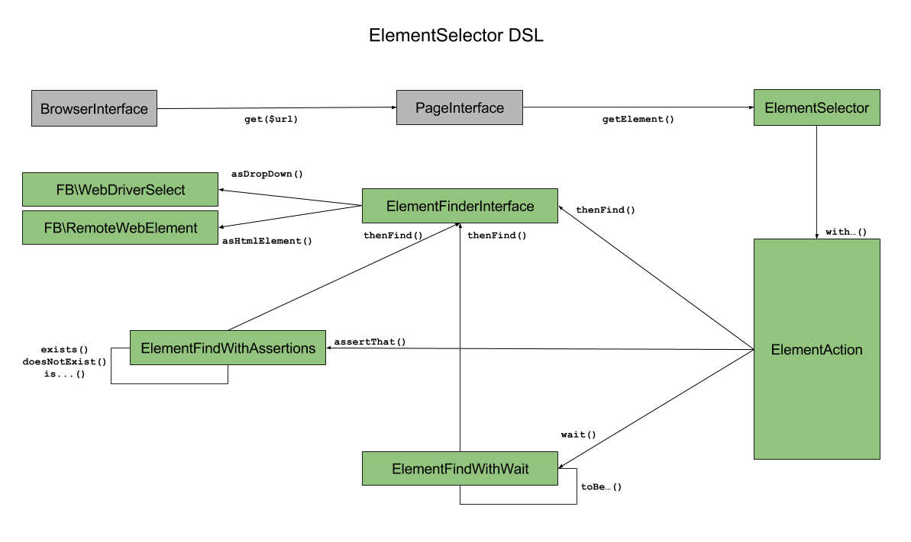

# PHP Fluent WebDriver Client

[](https://travis-ci.org/athena-oss/php-fluent-webdriver-client)
[](https://coveralls.io/github/athena-oss/php-fluent-webdriver-client?branch=master)

A fluent DSL for writing browser tests.

## Table of Contents
* [Installation](README.md#installation)
* [External requirements](README.md#external-requirements)
* [Usage](README.md#usage)
  * [Synchronous assertions](README.md#synchronous-assertions)
  * [Asynchronous assertions](README.md#asynchronous-assertions)
* [Visual representation of the DSL](README.md#visual-representation-of-the-dsl)
* [Facebook WebDriver dependency](README.md#facebook-webdriver-dependency)
* [API docs](README.md#api-docs)
* [Contributing](README.md#contributing)
* [Versioning](README.md#versioning)
* [License](README.md#license)

## Installation

The recommended way of installing it is by using Composer:
```sh
$ composer require athena-oss/php-fluent-webdriver-client:dev-master
```

## External requirements

The library is meant to be used alongside [Selenium](http://www.seleniumhq.org/), which is in charge of wrapping different browser vendors behind a unified [WebDriver spec](https://www.w3.org/TR/webdriver/). In order to be able to run the code samples contained in this document you'll need to download and run Selenium locally. For running the code examples you'll additionally need to install [PhantomJS](http://phantomjs.org/).

## Usage

The library attempts to reduce the boilerplate code needed to write browser tests by providing an opinionated DSL. The DSL allows for two distinct patterns of tests:
- Synchronous assertions
- Asynchronous assertions

### Synchronous assertions

Synchronous assertions are those expressed with the following pattern:
- Fetch URL
- Convert fetched HTML document into a Page Object
- Find an element by custom selector
- Assert that the element is enabled/selected/visible etc.
- (Optionally) Perform action on element (click, clear, submit)

Sample:

```php
namespace OLX\SampleWebDriver\Tests;

use OLX\FluentWebDriverClient\Browser\Browser;
use OLX\FluentWebDriverClient\Browser\BrowserDriverBuilder;

class WikipediaBrowserTest extends \PHPUnit_Framework_TestCase
{
    public function testArticlePage_RegularArticleInEnglish_ShouldDisplayArticleTitleAsHeader()
    {
        $driver = (new BrowserDriverBuilder('http://localhost:4444/wd/hub'))
            ->withType('phantomjs')
            ->build();

        $browser = new Browser($driver);

        $browser->get('https://en.wikipedia.org/wiki/Athena')
            ->getElement()
            ->withCss('h1#firstHeading')
            ->assertThat()
            ->isHidden()
            ->thenFind()
            ->asHtmlElement();
    }
}
```

Running the above test would fail (an Exception is thrown), as an element matching the given CSS exists in the DOM and is visible.

### Asynchronous assertions

Synchronous assertions are those expressed with the following pattern:
- Fetch URL
- Convert fetched HTML document into a Page Object
- Find an element by custom selector
- Wait for a condition on the element (a timeout means the assertion failed)
- (Optionally) Perform action on element (click, clear, submit)

Sample:
```php
namespace OLX\SampleWebDriver\Tests;

use OLX\FluentWebDriverClient\Browser\Browser;
use OLX\FluentWebDriverClient\Browser\BrowserDriverBuilder;

class WikipediaBrowserTest extends \PHPUnit_Framework_TestCase
{
    public function testArticlePage_RegularArticleInEnglish_ShouldDisplaySpecialHeaderAfter3Seconds()
    {
        $driver = (new BrowserDriverBuilder('http://localhost:4444/wd/hub'))
            ->withType('phantomjs')
            ->build();

        $browser = new Browser($driver);

        $browser->get('https://en.wikipedia.org/wiki/Athena')
            ->getElement()
            ->withCss('h1#specialHeading')
            ->wait(3)
            ->toBeVisible()
            ->thenFind()
            ->asHtmlElement();
    }
}
```

Running the above test would fail (an Exception is thrown), as an element matching the given CSS doesn't exist in the DOM 3 seconds after the DOM was ready.

## Visual representation of the DSL

The diagram bellow illustrates the methods that can be called in each state of the call chain. A few key points:
- The names inside each rectangle, when not prefixed, correspond to interfaces and classes in the library
- The FB prefix corresponds to the Facebook PHP WebDriver package



## Facebook WebDriver dependency

The [Facebook PHP WebDriver](https://github.com/facebook/php-webdriver) is the underlying implementation of all communication between the library and the Selenium HTTP API. At its current state, the DSL can't hide away the Facebook implementation completely. Therefore it is recommended that you read their documentation in case you're using any of the DSL methods which return a Facebook type.

Replacing the Facebook implementation by our own Selenium API abstraction is currently not among one of the project top priorities, but it's an improvement we're considering implementing (as a major, backward-incompatible version).

## API docs

An [API documentation](http://athena-oss.github.io/php-fluent-webdriver-client/sami) is provided.

## Contributing

Checkout our guidelines on how to contribute in [CONTRIBUTING.md](CONTRIBUTING.md).

## Versioning

Releases are managed using github's release feature. We use [Semantic Versioning](http://semver.org) for all
the releases. Every change made to the code base will be referred to in the release notes (except for
cleanups and refactorings).

## License

Licensed under the [Apache License Version 2.0 (APLv2)](LICENSE).
